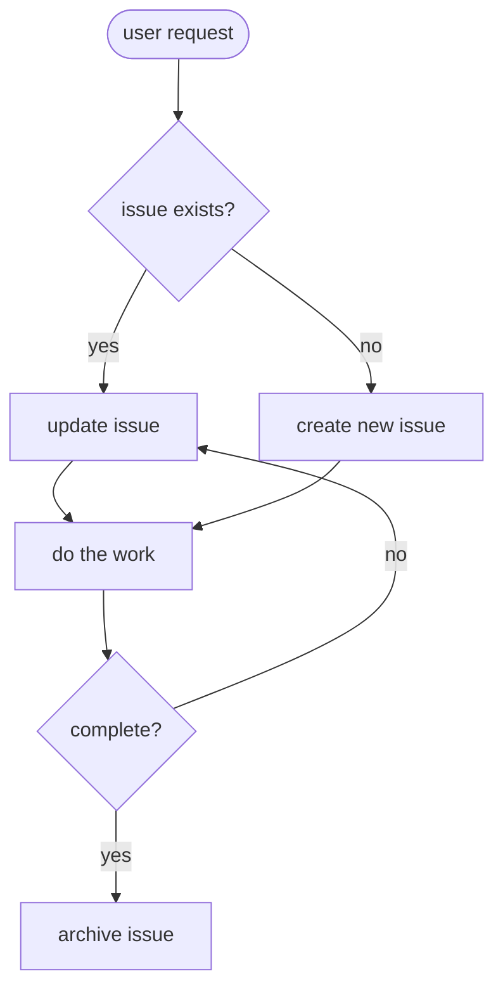
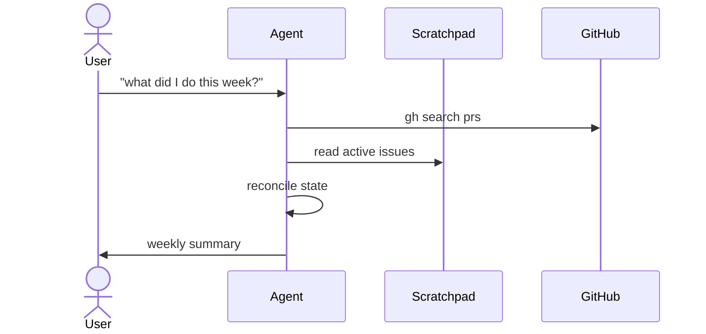
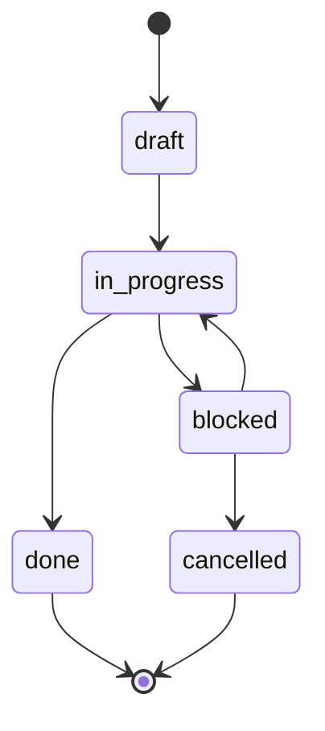

# Diagrams

Create visual explanations inside scratchpad docs, issues, and RFCs.

## Use This When

- A flow has more than three steps with branching.
- A system has more than two components that interact.
- A decision has multiple conditions the reader has to hold in their head.
- A state transition needs to be shown (before/after, phase N vs phase N+1).
- A lifecycle crosses multiple actors or services.

Do not use for:

- Simple two-step flows (prose is clearer).
- Lists of items that don't have relationships (use a bullet list or table).
- Code that speaks for itself.

## Format Selection

Default order of preference:

1. **Mermaid** — renders natively in GitHub, Obsidian, and most Markdown previewers. Use for flowcharts, sequence diagrams, state diagrams, ER, class, and gantt.
2. **D2** — when Mermaid can't express the topology (e.g., dense graphs, container nesting, explicit layouts). Requires a D2 renderer; note this in the doc.
3. **ASCII** — when the diagram is small and portability matters (terminal output, plain-text READMEs). Put inside a fenced code block.

Only one diagram form per artifact unless the second genuinely adds information the first cannot.

## Embedding

### In issues

Put the diagram in `## Approach` or `## Notes` when it clarifies an implementation choice. Keep it short — issues are working documents.

### In docs

Put the diagram near `## Overview` or inside the specific section it explains. Docs can carry larger, more detailed diagrams than issues.

### In RFCs

Diagrams often live in `## Current State` (to show what exists) and `## Proposed Solution` (to show what will exist). Having both side-by-side makes the delta legible.

## Mermaid Patterns

### Flowchart (default)

### Sequence diagram

### State diagram

## Quality Bar

- **Labeled nodes only** — every node has a short, concrete label. No `A`, `B`, `C` placeholders.
- **Direction is explicit** — `TD` (top-down), `LR` (left-right), or the appropriate diagram-type direction. Readers shouldn't guess.
- **Fewer than ~12 nodes** — past that, split into multiple diagrams or summarize with a table.
- **Legend when using colors or shapes** — but prefer plain diagrams that don't need one.
- **Verify it renders** — after writing, open the artifact (`obsidian open file="N-slug" silent` or paste into GitHub preview) and confirm the diagram renders without syntax errors. A broken diagram is worse than no diagram.
- **Keep the source readable** — prefer short labels and Mermaid's default styling. Don't build art projects.

## Common Mistakes

- Arrow direction ambiguity (`A --- B` instead of `A --> B`) — always be explicit.
- Node labels with parentheses or quotes that break the parser — wrap in `["..."]` when unsure.
- Too much detail — a diagram should show structure, not restate the prose.
- Using a flowchart when a state diagram would be clearer (and vice versa).
